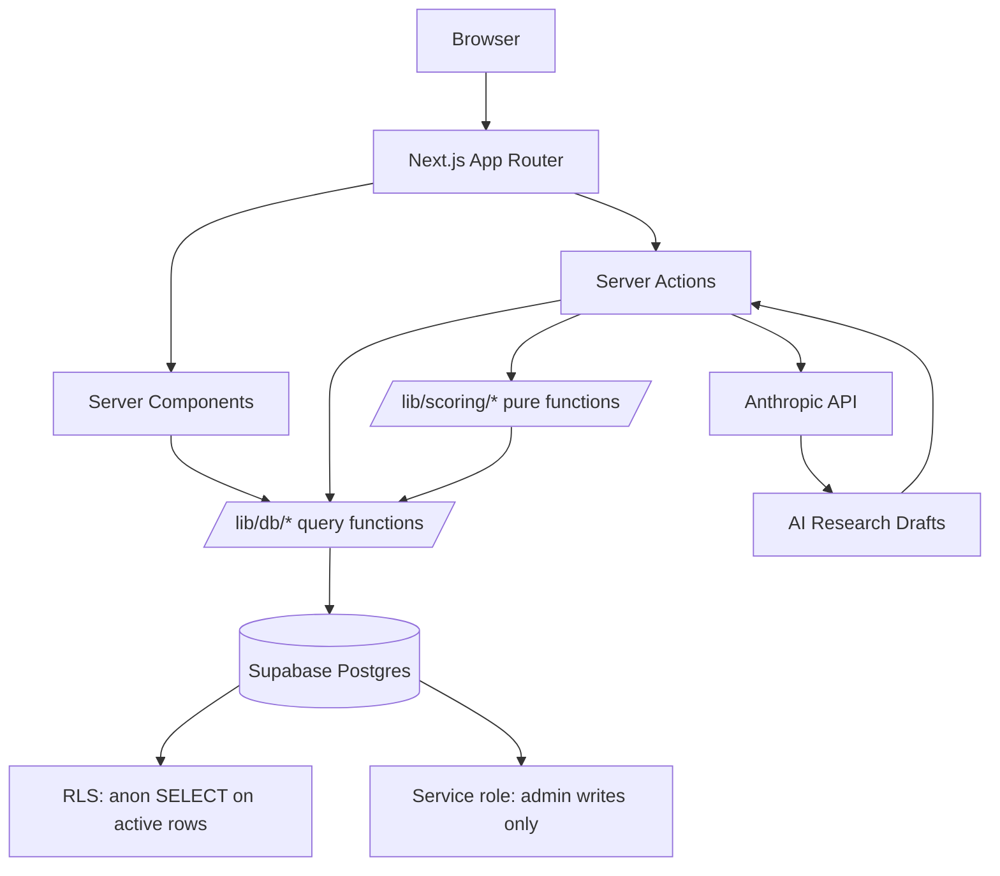

# CatalystMap

**Live demo:** https://getcatalystmap.com

A supply-chain and contract intelligence tool that maps high-attention catalyst companies — SpaceX, Anthropic, SK Hynix, NVIDIA, and others — to their publicly traded suppliers, contractors, infrastructure providers, and value-chain beneficiaries. Every relationship is typed, source-cited, and scored with a transparent, deterministic formula.

**Live:** [getcatalystmap.com](https://getcatalystmap.com)

---

## Problem

Major market themes (AI, semiconductors, space, defense) are driven by catalyst companies that retail investors often can't access directly — they're private (SpaceX, Anthropic), foreign (SK Hynix, TSMC), or pre-IPO. Existing financial tools excel at valuation and screening but none answer: _"Who is in this catalyst's supply chain?"_ Investors must cobble this together from earnings calls, SEC filings, supplier disclosures, and analyst notes.

## Solution

CatalystMap consolidates that work into a single, evidenced graph. Every relationship between a catalyst and a public company has:

- A **typed link** (supplier, customer, infrastructure, partnership, investment, thematic, speculative)
- A **strength classification** (direct, indirect, speculative)
- At least one **verifiable source** with a quality tier
- A **relevance score** (0–100) computed deterministically from a transparent formula
- A **hype-risk** flag

## How it works

Catalyst companies are curated by a human maintainer, with optional AI-assisted research (Claude Sonnet 4.6 proposes candidates; the curator approves or discards each one). The scoring engine runs server-side on every insert/update, caching scores on the relationship row and appending an audit trail to `score_snapshots`. The frontend reads cached values — it never recomputes.

---

## Tech stack

| Layer       | Choice                      | Rationale                                                              |
| ----------- | --------------------------- | ---------------------------------------------------------------------- |
| Framework   | Next.js 14 (App Router)     | Server components for data-heavy pages; Server Actions for admin forms |
| Language    | TypeScript (strict)         | Type safety across DB boundary, scoring engine, and UI                 |
| Styling     | Tailwind CSS + shadcn/ui    | Rapid iteration with a consistent design system                        |
| Database    | Supabase (Postgres)         | Managed Postgres with RLS, instant API, and edge functions             |
| AI research | Anthropic Claude Sonnet 4.6 | Structured research output with grounded evidence                      |
| Auth        | jose (JWT)                  | Edge-compatible session cookies for admin password gate                |
| Testing     | Vitest                      | Fast unit tests for scoring engine + validation                        |
| Hosting     | Vercel                      | Zero-config deployment, edge network, preview builds                   |

---

## Architecture



---

## Scoring formula (v2)

```
score =
    0.40 * direct_score          (type x strength matrix — suppliers/customers at top)
  + 0.20 * revenue_exposure      (% of revenue tied to catalyst)
  + 0.15 * source_quality        (best source tier + agreement bonus)
  + 0.10 * recency               (days since last verification)
  + 0.05 * momentum              (neutral in v2)
  + contract_size_bonus           (0–10 for disclosed contract values)
  + government_procurement_bonus  (0–3 for government contracts)
  - hype_risk_penalty             (0/5/15)

Clamped to [0, 100].
```

**Example:** A confirmed supplier (direct, 15% revenue exposure, SEC filing + earnings call sources, verified 60 days ago, $500M government contract, low hype risk) scores **91.5**.

---

## Run locally

```bash
git clone https://github.com/jo-emily-jo/catalystmap.git
cd catalystmap
npm install
cp .env.example .env.local
# Fill in: NEXT_PUBLIC_SUPABASE_URL, NEXT_PUBLIC_SUPABASE_ANON_KEY,
#          SUPABASE_SERVICE_ROLE_KEY, ADMIN_PASSWORD, ANTHROPIC_API_KEY
npm run dev          # http://localhost:3000
npm run db:seed      # seed themes + example catalyst
npm run db:recompute # recompute all scores
npm test             # run unit tests
npm run typecheck    # TypeScript strict check
npm run lint         # ESLint
```

---

## Roadmap

- [ ] Additional catalyst companies (3–5 across themes)
- [ ] Reverse ticker lookup (search by ticker → see all catalysts)
- [ ] Relationship change history + timeline view
- [ ] Public read-only API
- [ ] Dark mode toggle

## Known limitations

- Single-curator model (no multi-user auth)
- AI research URLs are often unverified — curator must confirm
- Momentum score is neutral (always 50) — price-relative features deferred
- No real-time data — relationships are curated periodically

---

## Credits

Built by [Emily Jo](https://github.com/jo-emily-jo) as a portfolio project demonstrating product thinking, data modeling, and full-stack engineering.

AI-assisted development: this project was built with Claude Code (Anthropic's Claude Opus 4.6). AI assisted with code generation, architecture decisions, and scoring engine implementation. All code was reviewed, tested, and approved by a human developer. The AI research feature uses Claude Sonnet 4.6 in a curator-in-the-loop workflow — AI proposes, humans approve.

---

_For research and educational purposes only. Not financial advice and not a recommendation to buy or sell any security._
